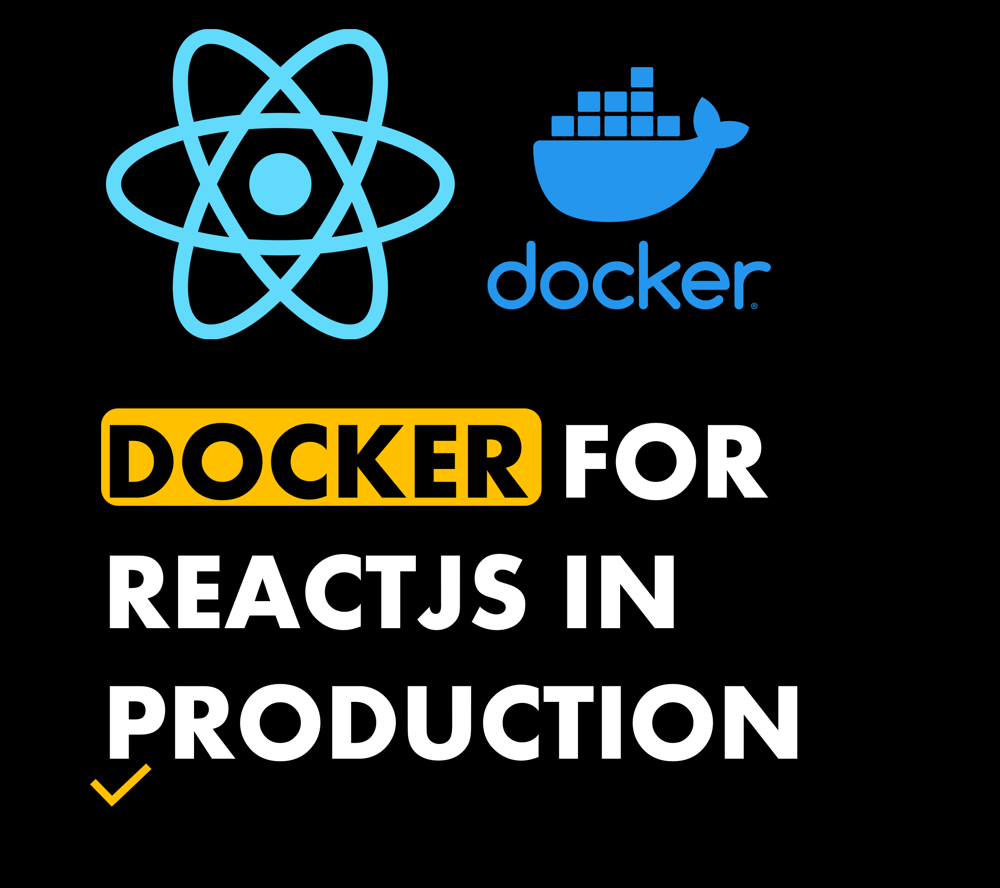
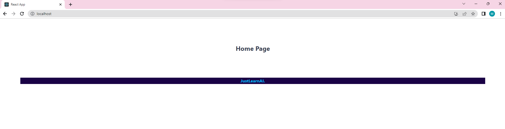
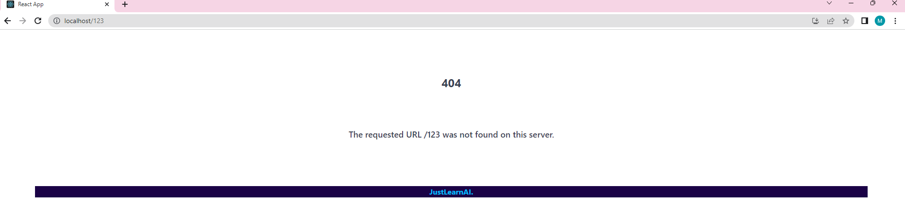

## **Docker for your Production Capable ReactJS Application**
How to Containerize your React App for Production.

---



You will need:
- Docker Desktop
- Node

Prerequisite Links:
- [Github](https://github.com/mo-justlearnai/Get-Started-with-ReactJS-2023)

Finished Links:
- [Github](https://github.com/mo-justlearnai/Docker-for-your-ReactJS-Application)

I will be working from a previous react app I built in [this](https://justlearnai.com/get-started-with-reactjs-2023-23773a8911a2) article.

Ok, Let's get started. 

## Testing and Configuration

For the react app to work as a docker image there are 2 files we need to focus on. 
Of course the dockerfile which provides the runtime environment etc and also the nginx configuration for the web server.. that serves our react app.

Before that, if you haven’t done so already copy the reactapp folder from [here](https://github.com/mo-justlearnai/Get-Started-with-ReactJS-2023) to a new project folder to hold all of our folders and files. 

Just to test it, let's test out reactapp. 

**Run commands from within the reactapp**

```shell
cd reactapp
```

First, run the below command to install all the node modules from the package.json

```shell
npm install
```

Now let's run the app

```shell
npm start
```


Let's also test that our 404 page that handles all paths that cannot be found is working. 


Create a folder called 'nginx-manifests'
Create a file called 'nginx.conf'

This configuration states that the NGINX server should listen on port 80;
The file also handles the configuration to serve files based on the request received. 

**nginx.conf**
```conf
# ==================================================
# Title: Nginx configuration 
# Author: Mattithyahu
# Created Date: 23/07/2023 
# ==================================================

# Listening on port 80

server {
 listen 80;
 
 location / {
   root /usr/share/nginx/html/;
   include /etc/nginx/mime.types;
   try_files $uri $uri/ /index.html;
 }
}
```

Create a folder called 'docker-manifests'
Create a file called '.dockerignore'

**.dockerignore**
```shell
# Folders 
node_modules
```

Create a file called '.dockerignore' in the 'docker-manifests' folder

The docker file essentially builds the app and moves the build files to be served by nginx with the applied nginx configuration file above. 

I chose to use node 20.3.1 because that is my local version of node. 

To check your local version
Run

```shell
node -v
#v20.3.1
```

**Dockerfile.frontend**
```shell
# ==================================================  
# Title: Build App Frontend
# Author: Mattithyahu 
# Created Date: 23/07/2023  
# ==================================================

# Pulling official node base image
FROM node:20.3.1-alpine AS builder

# # Argument pathtoservice
ARG PATHTOSERVICE=./reactapp

# Setting node environment to production
ENV NODE_ENV production

# Setting working directory
WORKDIR /app

# Installing dependencies
COPY $PATHTOSERVICE/package.json ./
RUN npm install --force

# Copying all the files in our project
COPY $PATHTOSERVICE ./

# Building app
RUN npm run build

# Removing source files from image
RUN rm -rf /app/src

# ---

# Pulling official nginx base image
FROM nginx

# Copying built assets from builder
COPY --from=builder /app/build /usr/share/nginx/html

# Copying nginx.conf
COPY ./nginx-manifests/nginx.conf /etc/nginx/conf.d/default.conf

```

Ok, now let's build the docker image.

## Build and Run Docker Image

From the root of the new project run the below command.

**Build**

```
docker build -t reactapp:latest -f ./docker-manifests/Dockerfile.frontend .
```

**Run**

```
docker run --name frontend -p 80:80 -d reactapp:latest
```



Let's try a path that is not available in our react-router-dom routes.



**Clean up**

To stop all containers running.
Run

```shell
docker stop $(docker ps -a -q)
```

Thanks for reading.

---
<!-- DONE -->
